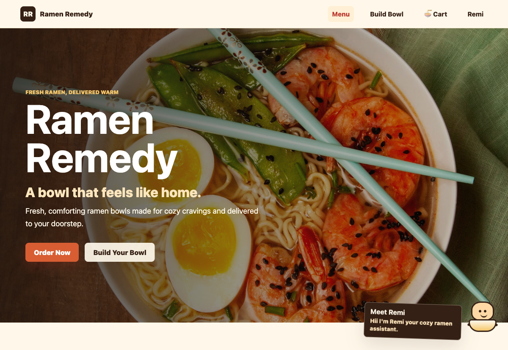
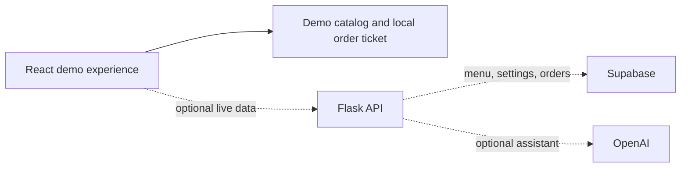

# Ramen Remedy

### Warm bowls. Soft landings. 

Ramen Remedy is a cozy ramen ordering experience built for an internship project. It turns a small menu into a full little journey: choose a bowl, make it yours, check out, and receive a polished order ticket.

<p align="center">
  <a href="https://ramen-ramedy.netlify.app/"><strong>Open the live demo →</strong></a>
</p>



## The demo

Visitors can:

- browse six ready-made ramen bowls
- build a custom bowl with broth, noodles, protein, spice, and toppings
- adjust a bowl in the cart
- enter delivery details and place a demo order
- see a ticket number and confirmation screen immediately
- meet Remi, the cozy ramen guide

The menu and checkout are intentionally demo-friendly right now. A placed order creates a local `RR-DEMO-######` ticket; it does not take payment, send a real delivery, or store customer details.

## Why it feels different

The interface takes its cues from a warm ramen counter: broth reds, toasted sesame, paper menus, steam, and small moments of motion. The goal is less “food ordering template” and more “a comforting place you want to come back to.”

## Built with

| Layer | Stack |
| --- | --- |
| Experience | React, Vite, CSS |
| API | Python, Flask, Flask-CORS |
| Data | Supabase |
| Assistants | Remi fallback logic with optional OpenAI integration |
| Hosting | Netlify frontend, Render-ready Flask service definition |

## How it is wired



The public frontend does not need a backend to show the menu or complete the demo checkout. The Flask service remains available for the live-data version when the correct Supabase project is connected.

## Repository map

```text
ramen-remedy/
├── backend/
│   ├── app.py
│   ├── requirements.txt
│   └── supabase_schema.sql
├── frontend/
│   ├── index.html
│   └── src/
│       ├── App.jsx
│       ├── App.css
│       ├── components/
│       └── data/demoCatalog.js
├── docs/assets/ramen-remedy-home.png
├── netlify.toml
└── render.yaml
```

## Backend path

`backend/app.py` contains the Flask API for menu data, toppings, custom pricing, orders, settings, Remi, and the protected admin dashboard. `render.yaml` describes a production web service without committing any credentials.

To turn on live data, add the intended Supabase project's values through the hosting provider's secret environment variables. Never commit those values to the repository.

## Development checks

```bash
npm --prefix frontend install
npm --prefix frontend run build
node --test tests/*.test.mjs
/usr/bin/python3 -m pytest -q
```

## Safety boundaries

- Demo orders are clearly labelled and are not real purchases.
- No Supabase service key, OpenAI key, admin password, or admin token belongs in Git.
- The frontend never receives a Supabase service key.
- Admin mutations are designed to go through protected Flask routes.


Ramen Remedy is a small project about making a normal evening feel a little warmer — one bowl at a time.
