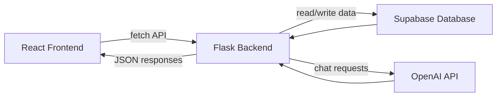

# Ramen Remedy

**A bowl that feels like home.**

Ramen Remedy is a full-stack ramen delivery web application built for an internship project. It includes a polished React customer experience, a Python Flask API, Supabase database storage, an OpenAI-powered customer assistant named Remi, and an admin-only developer assistant named RemiDev.

The project is designed to feel like a real food delivery website, while still being beginner-friendly and easy to explain in a presentation.

## Highlights

- Responsive React frontend with a cozy ramen-inspired UI
- Menu browsing with realistic ramen cards, prices, tags, and images
- Build Your Bowl flow with broth, noodles, protein, spice level, toppings, quantity, and special instructions
- Cart, checkout, mock order confirmation, and Cash on Delivery payment option
- Flask backend with JSON API routes
- Supabase database for menu items, toppings, builder options, orders, site settings, and admin logs
- Remi customer assistant for ramen suggestions and delivery/menu questions
- RemiDev admin assistant for safe developer-style updates through natural language commands
- Admin dashboard for menu, toppings, builder options, orders, logs, and rollback

## Tech Stack

| Layer | Technology |
| --- | --- |
| Frontend | React, Vite, CSS |
| Backend | Python, Flask, Flask-CORS |
| Database | Supabase |
| AI | OpenAI API |
| Admin | React admin dashboard + Flask protected API routes |

## Project Structure

```text
ramen-remedy/
├── backend/
│   ├── app.py
│   ├── requirements.txt
│   ├── supabase_schema.sql
│   └── .env.example
├── frontend/
│   ├── index.html
│   ├── package.json
│   ├── package-lock.json
│   └── src/
│       ├── App.jsx
│       ├── App.css
│       ├── main.jsx
│       ├── utils/
│       │   └── formatPrice.js
│       └── components/
│           ├── AdminDashboard.jsx
│           ├── Hero.jsx
│           ├── Menu.jsx
│           ├── CustomBuilder.jsx
│           ├── CartPage.jsx
│           ├── CheckoutPage.jsx
│           ├── RemiPage.jsx
│           ├── FloatingRemi.jsx
│           ├── About.jsx
│           └── Footer.jsx
├── .gitignore
└── README.md
```

## How The App Works



React handles the user interface. Flask works as the API layer between React, Supabase, and OpenAI. Supabase stores the live data. OpenAI powers the chat assistants, while Flask keeps the API keys secure on the backend.

## Main Features

### Customer Website

- Home hero section with the Ramen Remedy brand
- Menu page with six ramen bowls
- Custom ramen builder
- Cart page
- Checkout page
- Mock order confirmation
- Cash on Delivery payment option
- Floating Remi assistant icon
- Responsive layout for desktop and mobile

### Remi - Customer Assistant

Remi helps customers choose what to order. It can:

- Recommend spicy ramen
- Suggest vegetarian bowls
- Explain toppings
- Help build custom bowls
- Answer basic menu and delivery questions

Remi uses OpenAI when an API key is configured. If OpenAI is unavailable, the backend still has simple fallback replies so the demo does not break.

### Admin Dashboard

The admin dashboard is available at:

```text
http://localhost:5173/admin
```

The admin can:

- Add and edit menu items
- Add and edit toppings
- Add and edit custom builder options
- Hide or unhide items
- View mock orders
- Update order status
- Review admin logs
- Use RemiDev for natural language updates

### RemiDev - Developer Assistant

RemiDev is an admin-only assistant. It lets the developer type commands like:

```text
Change Korean Fire Ramen price to 1200
Add Garlic Butter topping for 100
Delete Garlic Butter from toppings
Change tagline to Warm bowls for cozy cravings
Update delivery fee to 200
Show recent orders
Undo last change
```

RemiDev does not directly edit React, CSS, Flask, or SQL files. Instead, it converts the admin command into a safe backend action, shows a preview, waits for confirmation, updates Supabase, and writes an admin log.

This is the safety flow:

```text
Admin command
-> Flask understands the command
-> Flask prepares a safe action preview
-> Admin confirms
-> Flask updates Supabase
-> Flask writes admin log
-> React refreshes the website data
```

## Supabase Tables

The database schema is in:

```text
backend/supabase_schema.sql
```

Tables used:

- `menu_items` - ramen bowl names, descriptions, prices, images, tags, availability
- `toppings` - topping names, icons, prices, availability
- `custom_options` - broth, noodle, protein, and spice options
- `orders` - mock customer orders and order status
- `site_settings` - theme color, logo URL, tagline, hero title, delivery fee
- `admin_logs` - admin and RemiDev actions with old/new values for rollback

## Environment Variables

Create a backend `.env` file from the example:

```powershell
cd backend
copy .env.example .env
```

Then fill in your own values:

```text
OPENAI_API_KEY=your_openai_api_key_here
OPENAI_MODEL=your_openai_model_name
SUPABASE_URL=your_supabase_project_url
SUPABASE_SECRET_KEY=your_supabase_secret_or_service_role_key
ADMIN_PASSWORD=your_admin_password
ADMIN_TOKEN=your_long_random_admin_token
ADMIN_NAME=Admin
REMI_FAST_MODE=true
OPENAI_TIMEOUT_SECONDS=6
```

Important: never commit the real `.env` file to GitHub.

## Run Locally

### 1. Backend

```powershell
cd backend
pip install -r requirements.txt
python app.py
```

Backend URL:

```text
http://localhost:5000
```

### 2. Frontend

Open a second terminal:

```powershell
cd frontend
npm install
npm run dev
```

Frontend URL:

```text
http://localhost:5173
```

## Useful API Routes

Public routes:

- `GET /api/menu`
- `GET /api/toppings`
- `GET /api/custom-options`
- `GET /api/settings`
- `POST /api/calculate-order`
- `POST /api/place-order`
- `POST /api/chatbot`

Admin routes:

- `POST /api/admin/login`
- `GET /api/admin/menu`
- `POST /api/admin/menu`
- `PUT /api/admin/menu/<id>`
- `GET /api/admin/toppings`
- `POST /api/admin/toppings`
- `PUT /api/admin/toppings/<id>`
- `GET /api/admin/orders`
- `PATCH /api/admin/orders/<id>/status`
- `POST /api/admin/dev-assistant`
- `POST /api/admin/confirm-action`
- `GET /api/admin/logs`
- `POST /api/admin/rollback`

## Presentation Summary

Ramen Remedy is a complete full-stack ramen delivery website. The frontend is built in React, the backend is built in Flask, Supabase stores the live menu and order data, and OpenAI powers two assistants. Remi helps customers choose ramen, while RemiDev helps the developer safely update menu prices, toppings, website settings, and order statuses through natural language commands.

The most important technical idea is that the AI does not directly change source code. Instead, RemiDev converts developer commands into safe backend actions, shows a preview, waits for confirmation, updates Supabase, and logs every change for rollback.

## Security Notes

- API keys are stored only in `backend/.env`
- `.env`, `.venv`, `node_modules`, and `dist` are ignored by Git
- Supabase service keys are never exposed in React
- Admin actions require an admin token
- RemiDev uses a fixed list of allowed backend actions
- Important changes use preview first, confirm later

## Author

Built as a final internship project.

